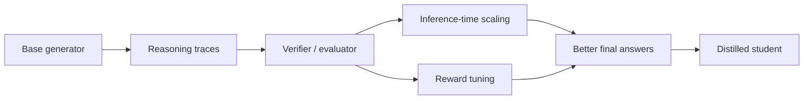

# Build a Reasoning Model From Scratch

An interview-friendly learning project for understanding how reasoning models are built on top of ordinary language models.

This repository is inspired by Sebastian Raschka's *Build a Reasoning Model (From Scratch)* MEAP. It does not copy the book or replace it. Instead, it turns the core ideas into a small runnable project you can step through, explain in interviews, and extend as you read.

## What This Project Demonstrates

Reasoning models are not magic wrappers around chatbots. The practical pipeline is:

1. Start with a base model that can generate text.
2. Define tasks where the answer can be checked.
3. Make the model produce intermediate steps before the final answer.
4. Measure accuracy with an evaluator.
5. Spend more inference compute by sampling several attempts and voting.
6. Train or tune behavior with reward signals.
7. Distill stronger reasoning behavior into a cheaper student model.

The code here uses a tiny arithmetic reasoning environment so the whole project runs locally with the Python standard library. The same ideas scale to real LLMs such as Qwen, Llama, or GPT-style decoder models when you swap the toy policy for a neural model.

## Pipeline



## Repository Map

```text
reasoning-model-from-scratch/
  README.md
  pyproject.toml
  src/reasoning_lab/
    dataset.py              # synthetic reasoning problems
    models.py               # base, trace, reward-tuned, distilled policies
    evaluate.py             # exact-match evaluator
    inference_scaling.py    # self-consistency / majority vote
    train_rl.py             # lightweight reward optimization demo
    distill.py              # teacher-to-student distillation demo
    cli.py                  # command line walkthrough
  tests/
    test_reasoning_lab.py
  docs/
    01_reasoning_pipeline.md
    02_interview_guide.md
    03_extension_roadmap.md
  examples/
    sample_run.md
```

## Quick Start

```bash
cd reasoning-model-from-scratch
python3 -m venv .venv
source .venv/bin/activate
python -m pip install -e .
python -m reasoning_lab.cli --problems 25 --samples 7
```

Run tests:

```bash
python -m unittest discover -s tests
```

## What You Should Be Able To Explain

After stepping through this project, you should be able to say:

- A base LLM predicts the next token, but a reasoning model is optimized to spend tokens on useful intermediate steps.
- Reasoning quality needs task-specific evaluation, not just "the answer sounds good."
- Chain-of-thought-style traces can improve multi-step tasks, but traces should be judged by final correctness and faithfulness.
- Inference-time scaling improves results by sampling multiple candidate solutions and selecting or voting among them.
- Reinforcement learning can improve reasoning when the task has verifiable rewards.
- Distillation transfers expensive reasoning behavior from a stronger teacher into a cheaper student.

## How The Demo Works

The toy task asks the model to solve short arithmetic word problems:

```text
Question: Maya has 6 marbles, buys 4 more, then gives away 3. How many remain?
Trace: Start with 6. Add 4 to get 10. Subtract 3 to get 7.
Final: 7
```

The project compares several policies:

- `DirectAnswerPolicy`: answers directly and sometimes makes arithmetic mistakes.
- `TraceReasoningPolicy`: writes intermediate steps before answering.
- `self_consistency`: samples several traces and votes on the final answer.
- `RewardTunedPolicy`: updates its reliability from verifiable rewards.
- `DistilledPolicy`: learns compact operation templates from a teacher.

This is intentionally small. The goal is to make the reasoning pipeline visible before replacing the toy policy with a neural LLM.

## Source Notes

The PDF outline used for this repository emphasizes:

- defining reasoning as producing intermediate steps before a final answer,
- loading and generating text with a base LLM,
- evaluating reasoning behavior,
- improving answers with inference-time compute,
- training with reinforcement learning and verifiable rewards,
- distilling reasoning behavior for efficient inference.

All explanations and code in this repository are original project material.

## Next GitHub Steps

```bash
git branch -M main
git remote add origin https://github.com/YOUR_USERNAME/reasoning-model-from-scratch.git
git push -u origin main
```

## Suggested Interview Framing

"I built a small reasoning-model lab to understand the full pipeline before scaling it to real LLMs. It starts with a weak direct-answer policy, adds explicit intermediate reasoning, evaluates final-answer accuracy, uses self-consistency to trade inference compute for quality, then demonstrates reward tuning and distillation with verifiable arithmetic tasks."
