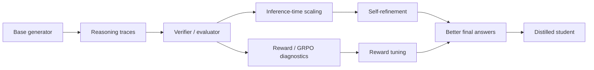
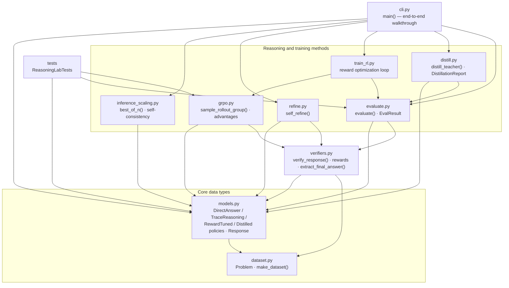

# My Reasoning Model Learning Lab

I created this project for my own understanding of how reasoning models are built on top of ordinary language models. It is also structured so I can walk through it in interviews and explain what I learned step by step.

The learning path is inspired by Sebastian Raschka's *Build a Reasoning Model (From Scratch)* MEAP. This repository does not copy the book or replace it. I used the PDF as a study guide and turned the main ideas into a small runnable project that helps me reason about the concepts in code.

## What This Project Demonstrates

The main idea I wanted to understand is that reasoning models are not magic wrappers around chatbots. A practical reasoning-model pipeline looks like this:

1. Start with a base model that can generate text.
2. Define tasks where the answer can be checked.
3. Make the model produce intermediate steps before the final answer.
4. Measure final-answer accuracy, trace consistency, response format, and reward.
5. Spend more inference compute by sampling several attempts, voting, ranking, or refining.
6. Train or tune behavior with verifiable reward signals.
7. Track rollout metrics such as rewards, advantages, entropy, response length, policy ratios, and KL drift.
8. Distill stronger reasoning behavior into a cheaper student model.

I kept the code intentionally small by using arithmetic word problems. That lets me focus on the reasoning pipeline itself without needing a GPU or a large model. The same structure can later be extended to real LLMs such as Qwen, Llama, or GPT-style decoder models.

## Pipeline



## Repository Map

```text
reasoning-model-from-scratch/
  README.md
  pyproject.toml
  src/reasoning_lab/
    dataset.py              # synthetic reasoning problems
    models.py               # base, trace, reward-tuned, distilled policies
    evaluate.py             # final-answer, trace, format, and reward evaluator
    verifiers.py            # answer extraction, trace checks, composite rewards
    inference_scaling.py    # self-consistency and best-of-N selection
    refine.py               # verifier-guided self-refinement loop
    grpo.py                 # rollout groups, advantages, clipping, diagnostics
    train_rl.py             # lightweight reward optimization and diagnostics
    distill.py              # teacher-to-student distillation demo
    cli.py                  # command line walkthrough
  tests/
    test_reasoning_lab.py
  docs/
    01_reasoning_pipeline.md
    02_interview_guide.md
    03_extension_roadmap.md
    04_refinement_playbook.md
    05_pdf_study_map.md
    06_book_chapter_study_notes.md
  examples/
    sample_run.md
```

## Knowledge Graph

The diagram below is the project's **code knowledge graph** — the actual
module dependencies extracted from the source with
[`graphifyy`](https://github.com/safishamsi/graphify) (AST analysis, code only,
no docs). Arrows point from a module to what it uses. `dataset.py` (the
`Problem` type) and `models.py` (the policies and `Response`) are the core
abstractions everything flows through; `cli.py` orchestrates the full pipeline.



An **interactive** version (zoom, pan, 147 nodes / 401 edges, clustered by
module) is generated to `docs/knowledge-graph.html`. GitHub can't run it inline,
so open it locally, or view it rendered via
[htmlpreview](https://htmlpreview.github.io/?https://github.com/OctavianRo/reasoning-model-from-scratch/blob/main/docs/knowledge-graph.html).
Regenerate after code changes with `graphify update .` (code-only rules live in
`.graphifyignore`).

## Quick Start

```bash
cd reasoning-model-from-scratch
python3 -m venv .venv
source .venv/bin/activate
python -m pip install -e .
python -m reasoning_lab.cli --problems 25 --samples 7
```

Run tests:

```bash
python -m unittest discover -s tests
```

## What You Should Be Able To Explain

After stepping through this project, I should be able to explain:

- A base LLM predicts the next token, but a reasoning model is optimized to spend tokens on useful intermediate steps.
- Reasoning quality needs task-specific evaluation, not just "the answer sounds good."
- Chain-of-thought-style traces can improve multi-step tasks, but traces should be judged by final correctness and faithfulness.
- Inference-time scaling improves results by sampling multiple candidate solutions and selecting or voting among them.
- Reinforcement learning can improve reasoning when the task has verifiable rewards.
- Distillation transfers expensive reasoning behavior from a stronger teacher into a cheaper student.

## How The Demo Works

The toy task asks a policy to solve short arithmetic word problems:

```text
Question: Maya has 6 marbles, buys 4 more, then gives away 3. How many remain?
Trace: Start with 6. Add 4 to get 10. Subtract 3 to get 7.
Final: 7
```

The project compares several policies:

- `DirectAnswerPolicy`: answers directly and sometimes makes arithmetic mistakes.
- `TraceReasoningPolicy`: writes intermediate steps before answering.
- `self_consistency`: samples several traces and votes on the final answer.
- `best_of_n`: samples several traces and chooses the strongest candidate by verifier-style reward.
- `self_refine`: critiques and revises a candidate answer using verifier feedback.
- `RewardTunedPolicy`: updates its reliability from verifiable rewards.
- `DistilledPolicy`: learns compact operation templates from a teacher.

The enriched evaluator separates the signals a real reasoning-model training run would care about:

- **Answer correctness**: whether the final answer matches ground truth.
- **Extractability**: whether the final answer appears in a consistent parseable format.
- **Trace consistency**: whether the shown reasoning steps match the arithmetic.
- **Composite reward**: a simple weighted reward used for ranking and diagnostics.

The GRPO-style module does not train neural weights. Instead, it makes the required bookkeeping visible:

- sample several rollouts for the same prompt,
- score each rollout with a verifier,
- normalize rewards into advantages within the group,
- inspect entropy, response length, policy ratios, clipped objectives, KL drift, and format pass rate,
- use those metrics to reason about whether a training run is improving, collapsing, or over-optimizing a weak reward.

The distillation section reports concrete metrics:

```text
Baseline accuracy:            76.0%
Teacher accuracy:             100.0%
Distilled student accuracy:   100.0%
Accuracy gain vs baseline:    +24.0%
Teacher accuracy retained:    100.0%
Teacher calls before:         25
Teacher calls after:          0
Teacher call reduction:       100.0%
```

The key takeaway is that the student keeps the teacher's accuracy on this task while avoiding teacher calls at inference time. In this toy project, that is the measurable performance improvement from distillation.

This is intentionally small. My goal is to make the reasoning pipeline visible before replacing the toy policy with a neural LLM. The enriched version now models the deeper refinement checklist: reliable evaluation, inference-time scaling, verifier-guided refinement, reward-based training signals, stability diagnostics, and distillation.

## Study Notes

The PDF outline I used while studying emphasizes:

- defining reasoning as producing intermediate steps before a final answer,
- loading and generating text with a base LLM,
- evaluating reasoning behavior,
- improving answers with inference-time compute,
- using self-refinement to critique and revise answers,
- training with reinforcement learning and verifiable rewards,
- monitoring GRPO stability with reward, advantage, entropy, clipping, KL, and format metrics,
- distilling reasoning behavior for efficient inference.

All explanations and code in this repository are my own project material, written as a study artifact.

## Next GitHub Steps

```bash
git branch -M main
git remote add origin https://github.com/YOUR_USERNAME/reasoning-model-from-scratch.git
git push -u origin main
```

## How I Would Explain This In An Interview

"I built a small reasoning-model lab to understand the full pipeline before scaling it to real LLMs. It starts with a weak direct-answer policy, adds explicit intermediate reasoning, evaluates final-answer accuracy, uses self-consistency to trade inference compute for quality, then demonstrates reward tuning and distillation with verifiable arithmetic tasks."
